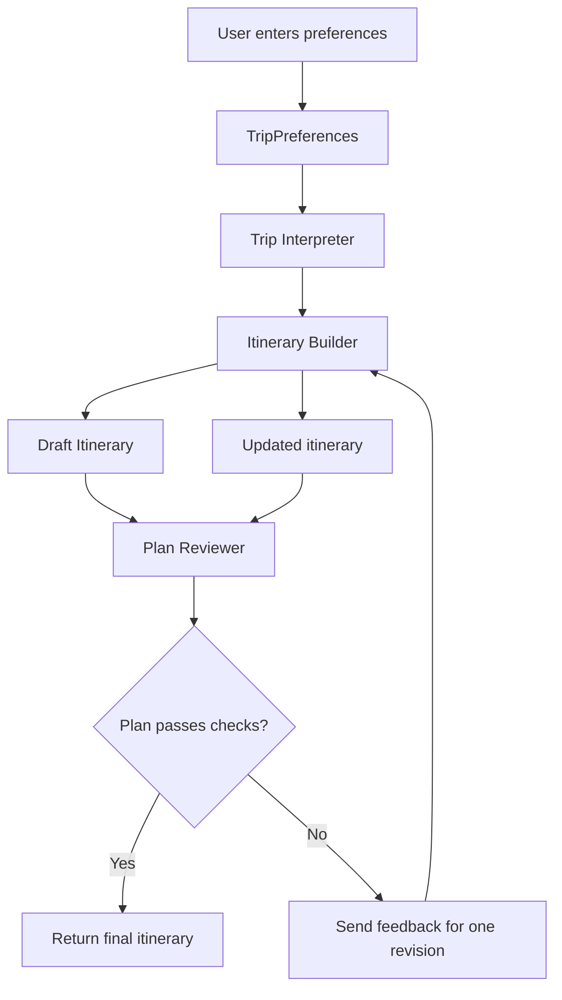

# Travel Planner Architecture

## Multi-Agent Workflow

```mermaid
flowchart TD
    U[User enters preferences]
    P[TripPreferences]
    A[Trip Interpreter]
    B[Itinerary Builder]
    D[Draft Itinerary]
    C[Plan Reviewer]
    E{Plan passes checks?}
    F[Return final itinerary]
    G[Send feedback for one revision]
    H[Updated itinerary]

    U --> P
    P --> A
    A --> B
    B --> D
    D --> C
    C --> E
    E -->|Yes| F
    E -->|No| G
    G --> B
    B --> H
    H --> C
```
