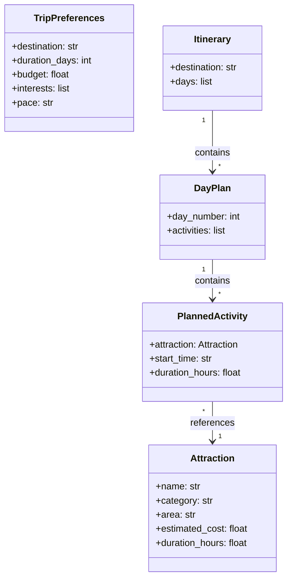

# Travel Planner Data Model

This diagram shows the main data structures
used by the travel planning system.

```mermaid
classDiagram
    class TripPreferences {
        +destination: str
        +duration_days: int
        +budget: float
        +interests: list
        +pace: str
    }

    class Attraction {
        +name: str
        +category: str
        +area: str
        +estimated_cost: float
        +duration_hours: float
    }

    class PlannedActivity {
        +attraction: Attraction
        +start_time: str
        +duration_hours: float
    }

    class DayPlan {
        +day_number: int
        +activities: list
    }

    class Itinerary {
        +destination: str
        +days: list
    }

    DayPlan "1" --> "*" PlannedActivity : contains
    PlannedActivity "*" --> "1" Attraction : references
    Itinerary "1" --> "*" DayPlan : contains
```
